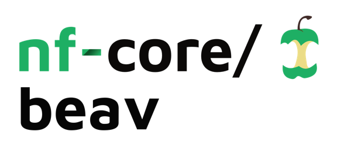
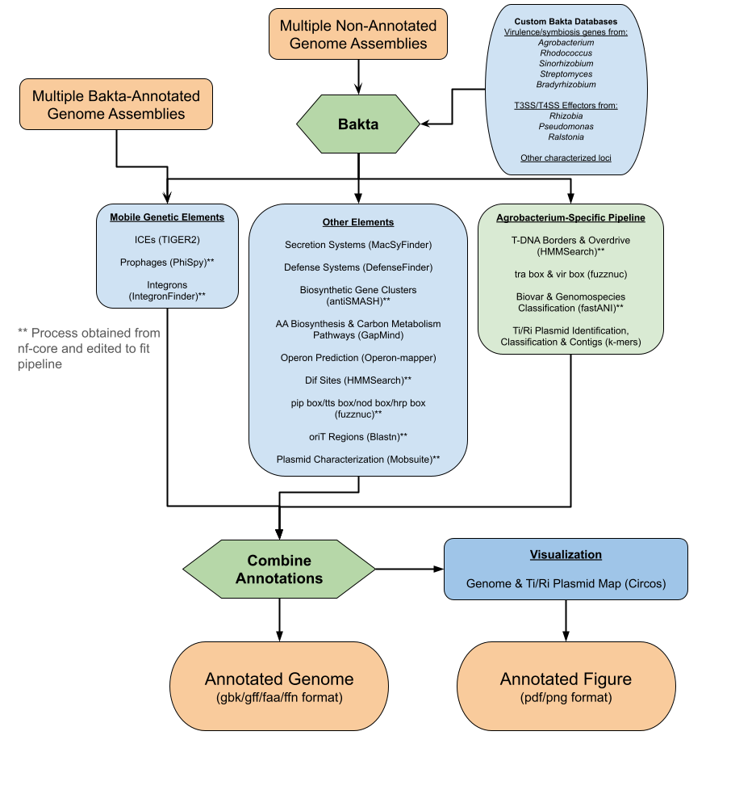

<h1>
  <picture>
    <source media="(prefers-color-scheme: dark)" srcset="docs/images/nf-core-beav_logo_dark.png">
    
  </picture>
</h1>

## Introduction

**nf-core/beav**(Bacterial Element Annotation reVamped) is a bioinformatics pipeline that takes bacteria sequences, either raw fasta sequences or from genbank, and annotates them to highlight bacterial elements. The output are 3 annotated sequece files in different common formats, and a Circos plot with the annotations shown. Tools specific to agrobacterium are also optionally available.

[]

## Usage

> [!NOTE]
> If you are new to Nextflow and nf-core, please refer to [this page](https://nf-co.re/docs/usage/installation) on how to set-up Nextflow. Make sure to [test your setup](https://nf-co.re/docs/usage/introduction#how-to-run-a-pipeline) with `-profile test` before running the workflow on actual data.

Step 1: Clone the beav_dir dependencies from [] into a desired location for databases. Preferably, this will be a location with enough storage space for large databases(bakta, antiSMASH), unless you already have these databases stored somewhere else.

Step 2: Set nextflow and environment variables. Open the 'nextflow.config' file in your preferred editor and create a profile(recommended) or change the defaults for the input parameters. 
  Important parameters to note: 
    input: directory of files, single file, comma-delimited list of files (default: ./inputFiles)
    outdir: directory where results are stored (default: ./results)
    beav_dir: directory where databases are stored (default: ./beav_dir)
    bakta_db: directory where your bakta database is stored, if already downloaded (default: auto downloads to ./beav_dir)
    antismash_db: directory where your antiSMASH database is stored, if already downloaded (default: auto downloads to ./beav_dir)
    tiger_blast_db: location of a fasta file containing BLAST database information for TIGER to confirm ICE insertions (required, NO DEFAULT)
    operon_email: an email for operon mapper results to be sent to (default: none)
    agro/agrobacterium: a flag that runs the agrobacterium specific pipeline (default: false)

Step 3: Install dependencies. It is recommended to use a conda environment. The pipeline SHOULD be able to use either conda or singularity/apptainer to run its modules, so choose one or the other. Execute this command inside the directory containing the pipeline(where the beav_env.yml file is stored). 
 ```bash
 cd /path/to/nf-core-beav
 conda env create -n beav_env -f beav_env.yml
 ```

Step 4: Run the pipeline. It will automatically set up and download any databases you did not include in the parameters. Note that --input may be a PATH to a single file, a directory containing files(depth 1, automatically ignores unrelated files), or a comma-delimited list of files.
  ```bash
  nextflow run nf-core/beav \
    -profile <YOUR_PROFILE> \
    --input <sample.fna,sample2.fna / directory_of_samples> \
    --outdir <OUTDIR>
  ```

> [!WARNING]
> Please provide pipeline parameters via the CLI or Nextflow `-params-file` option. Custom config files including those provided by the `-c` Nextflow option can be used to provide any configuration _**except for parameters**_; see [docs](https://nf-co.re/docs/usage/getting_started/configuration#custom-configuration-files).

For more details and further functionality, please refer to the [usage documentation](https://nf-co.re/beav/usage) and the [parameter documentation](https://nf-co.re/beav/parameters).

## Pipeline output

To see the results of an example test run with a full size dataset refer to the [results](https://nf-co.re/beav/results) tab on the nf-core website pipeline page.
For more details about the output files and reports, please refer to the
[output documentation](https://nf-co.re/beav/output).

## Features

Main Pipeline

BAKTA: Automatic download of Bakta database (light/full) and Bakta annotation, and automatically skip Bakta on input files detected to already be annotated by Bakta

ANTISMASH: Automatic download of AntiSMASH database and AntiSMASH annotation

MOBSUITE_RECON: Reconstruct plasmids in bacterial assemblies

MACSYFINDER: Annotation of macromolecular systems, genetic pathways

DEFENSEFINDER: Annotation of defense systems

GAPMIND: Annotation of amino acid and carbon metabolism

NHMMER: Annotation of structural RNAs, transposable elements, other

FUZZNUC: Annotation of pip/tts/nod box

BLASTN: Search and annotation of oriT, dif sites

SOURMASH: Comparison to reference metagenomes

TIGER: Annotation of ICEs

INTEGRONFINDER: Annotation of integrons

PHISPY: Annotation of prophages

CIRCOS: Create a circular plot with all annotated elements


Agro-specific Pipeline (Optional)

FASTANI: Whole genome ANI computation

FUZZNUC: Annotation of tra/vir box

NHMMER: Annotation of T-DNA borders and Overdrive

IDENTIFY_TI_RI_PLASMIDS: Identify and classify Ti and Ri plasmids and contigs

## Credits

nf-core/beav was originally written by Ammon Larsen.

We thank the following people for their extensive assistance in the development of this pipeline:

  Alexandra Weisberg
  Arafat Rahman
  Jewell Jung
  The Oregon State University Center for Qualitative Life Sciences Team
  The Nextflow and nf-core community.

## Contributions and Support

If you would like to contribute to this pipeline, please see the [contributing guidelines](.github/CONTRIBUTING.md).

For further information or help, don't hesitate to get in touch on the [Slack `#beav` channel](https://nfcore.slack.com/channels/beav) (you can join with [this invite](https://nf-co.re/join/slack)).

## Citations

An extensive list of references for the tools used by the pipeline can be found in the [`CITATIONS.md`](CITATIONS.md) file.


